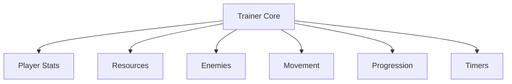

## Overview

Escape from Ever After Trainer is a runtime modification toolkit designed to manage core gameplay systems through direct value control and state manipulation. The trainer integrates with the game process to expose adjustable parameters such as player attributes, resource handling, encounter behavior, and progression logic. Built as a modular control layer, it allows selective activation of systems without altering core files. Escape from Ever After Trainer supports testing, sandbox experimentation, and controlled gameplay variation using configurable toggles and real-time updates.

---

## Player Attribute Control Layer

* Health value locking
* Damage intake scaling
* Stamina consumption override
* Status effect immunity flags

**In-game behavior:**
This system intercepts player stat calculations and enforces fixed or modified values during combat and traversal.

---

## Resource and Inventory Management System

* Currency value editing
* Item quantity freezing
* Consumable usage bypass
* Crafting requirement overrides

**Feature intent:**
Designed to control economic and inventory-related mechanics without triggering progression conflicts.

---

## Enemy and Encounter Modifiers

* Enemy health scaling
* Damage output reduction
* AI aggression toggle
* Encounter disable switch

**In-game behavior:**
Alters enemy evaluation routines to reduce difficulty or neutralize encounters entirely.

---

## Movement and Exploration Adjustments

* Movement speed multiplier
* Jump height adjustment
* Gravity scaling
* Collision bypass (noclip)

**Feature intent:**
Provides direct control over navigation systems for testing maps or bypassing environmental constraints.

---

## Progression and Checkpoint Controls

* Level completion flags
* Checkpoint activation
* Progress reset toggle
* Narrative lock bypass

**In-game behavior:**
Manipulates progression markers stored in memory to control story flow and checkpoints.

---

## Timer and Cooldown Overrides

* Ability cooldown removal
* Action delay bypass
* Event timer freeze
* Scripted wait skip

**Feature intent:**
Used to remove enforced delays and timing restrictions within gameplay systems.

---

## Runtime Toggle Interface

* Hotkey-based activation
* Modular feature switching
* Safe enable/disable handling
* Session-based persistence

**In-game behavior:**
Acts as the control surface for all trainer systems during active gameplay sessions.

---

---

## FAQ

**Does the trainer modify game files?**
No. All changes are applied in memory during runtime.

**Can features be enabled individually?**
Yes. Each system operates independently through toggles.

**Is the trainer session-based?**
Yes. Changes reset after restarting the game unless reactivated.

**Does it affect cutscenes or dialogue?**
Only if progression or timer systems are modified.

**Can movement changes break maps?**
Extreme values may bypass intended boundaries but do not alter files.

**Is hotkey configuration required?**
Default hotkeys are provided, with optional reassignment.

---

## Feature Summary

* Player stat manipulation system
* Resource and inventory control
* Enemy behavior and difficulty modifiers
* Movement and physics adjustments
* Progression and checkpoint management
* Timer and cooldown overrides
* Centralized runtime toggle interface
